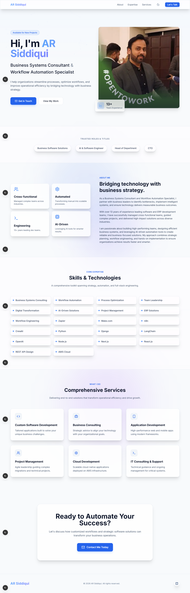
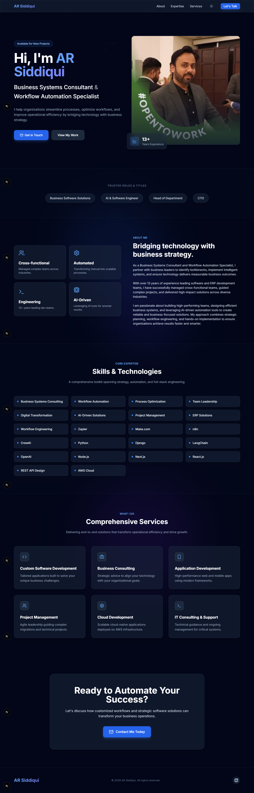

# AR Siddiqui - Portfolio Website

Welcome to the repository for my professional single-page portfolio website, showcasing my expertise as a **Business Systems Consultant** and **Workflow Automation Specialist**. The site is built using **Next.js**, **React**, and **Tailwind CSS**, with a premium, modern design.

---

## 🌐 Overview

This portfolio website highlights my professional journey, technical skills, and services. It features a sleek design, responsive layout, and interactive elements to engage visitors effectively.

---

## ⚡ Features & Implementation

- **Next.js & React Framework:**  
  Built using the App Router (`app/page.tsx`) for a fast, modern, single-page experience.

- **Premium Design Aesthetics:**  
  - Dark mode theme with slate and brand (blue) color palettes.  
  - Glassmorphism panels (`.glass-panel`) for a high-tech, modern feel.  
  - Subtle animations (fade-up), gradients, and interactive hover effects on cards and buttons.

- **Core Sections Developed:**  
  - **Hero Section:** Eye-catching introduction with dynamic background, title, and professional photo.  
  - **Trusted Roles:** Highlighting titles such as CTO and Head of Department.  
  - **About Me:** Structured summary of cross-functional, engineering, and AI leadership experience.  
  - **Core Expertise:** Grid of technical and strategic skills (Zapier, AWS, Python, Next.js, etc.).  
  - **Services:** Detailed service cards with relevant icons.  
  - **Contact:** Dedicated call-to-action section linking to email.

- **Icons:** Used `lucide-react` for clean, professional iconography throughout the site.

---

## 🖼️ Screenshots

### Day Mode


### Night Mode


---

## ✅ Verification

- Development server runs successfully:  
  ```bash
  npm run dev
